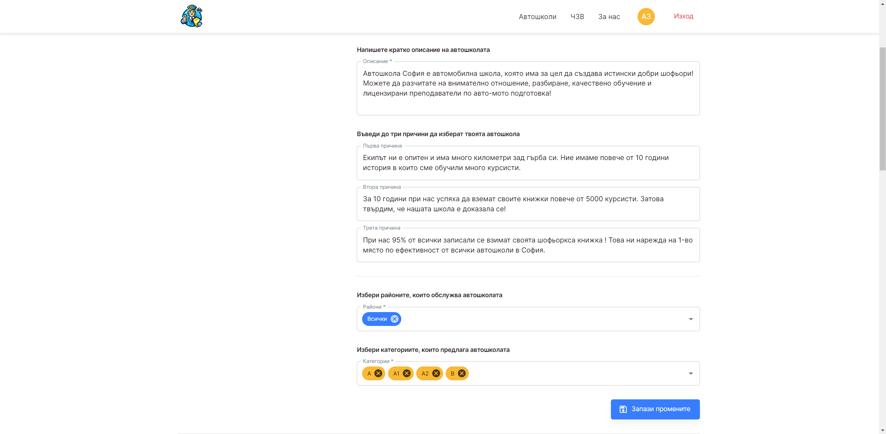
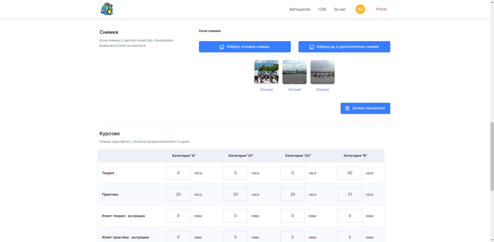
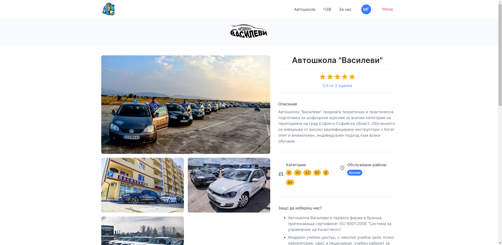
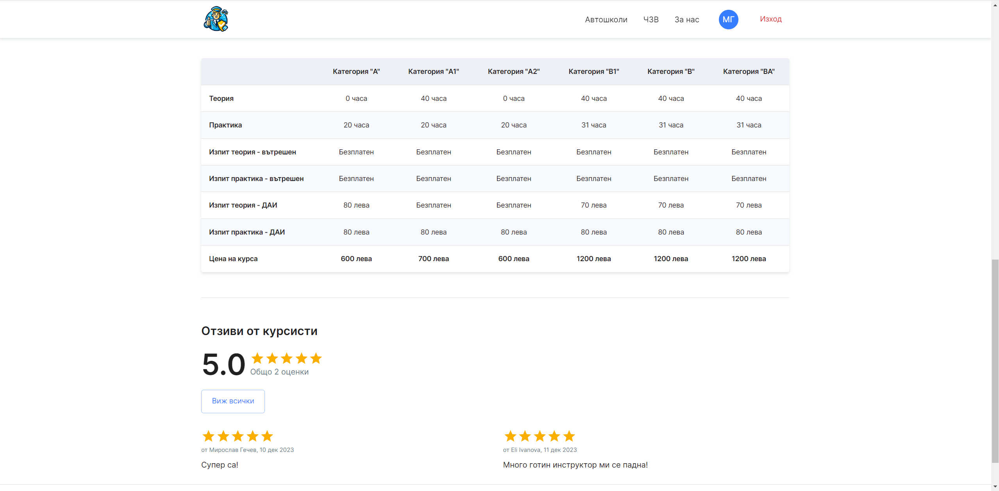

# Driving School Finder

## Description

Driving School Finder is a pioneering React application designed to bridge the gap in the driving school market, initially focusing on Sofia, Bulgaria. This platform serves as a dynamic marketplace for driving schools and prospective students.

Schools can manage their presence by creating, editing, and deleting their profiles. They provide comprehensive information including school descriptions, unique selling points, categories served (A, A1, A2, AM, B, B1, BA), regions covered within Sofia, a detailed pricing matrix for courses, and contact information.

Students, on the other hand, can register to explore and evaluate these schools. The app facilitates this by allowing them to rate and comment on schools, aiding their peers in making informed decisions.

Key Features:

- A catalog with advanced search functionality, enabling users to filter schools by name, region, rating, and category.
- Individual pages for each school, showcasing detailed information, offerings, pricing, and user-generated reviews and ratings.
- An FAQ section addressing common queries.
- Distinct profile management options for schools and students. Schools have the capability to edit their school information and profile details, whereas students can update their personal information and manage their own reviews and ratings.

This platform is more than just a directory; it's a community-driven tool that empowers students to find their ideal driving school, while providing schools with a robust channel to showcase their offerings.

## Screenshots

- Catalog Page

 | 

- Create-Edit Page

 | 

 | 

- Details Page

 | 

- Rating Page

 | 

## Installation

1. Clone the repository to your local machine.
2. Inside the project directory, install all required dependencies running `yarn install`.
3. Launch a development server using `yarn start`.
4. Set up your Firebase account, including Firestore, Firebase Storage, and Firebase Authentication services.
5. Create a `.env` file in the root directory of the project. Populate this file with your Firebase configuration details, ensuring that the variable names correspond with those in the app's `firebaseConfig.js`.

## Technologies Used

- **React 18.2**: Used as the core framework for building the user interface of the application.
- **React Router Dom**: Utilized for managing navigation and routing in the application, enabling seamless transitions between different views and states.
- **JavaScript**: The primary programming language used for scripting and adding interactivity to the web application.
- **Material UI**: A UI framework for designing elegant and responsive user interfaces consistent with Material Design principles.
- **HTML/CSS with modules**: HTML for structuring the web content and CSS modules for styling components in an encapsulated manner.
- **Responsive Design**: Ensures that the application is accessible and user-friendly across various devices and screen sizes.
- **AOS (Animate on Scroll)**: For adding smooth and visually appealing scroll animations to the web elements.
- **jssStyles**: Used for defining CSS styles in JavaScript, enhancing the dynamic styling capabilities within the React components.
- **CssBaseline**: Provides a consistent baseline CSS for ensuring cross-browser consistency.
- **Firestore**: Utilized as a NoSQL database for storing and retrieving application data in real-time.
- **Firebase Storage**: Used for storing and serving user-uploaded images.
- **Firebase Authentication**: Implements authentication features, allowing users to sign up, log in, and manage their profiles securely.
- **moment.js**: A library for parsing, validating, manipulating, and displaying dates and times in JavaScript.
- **ESLint/Prettier**: Used for code linting and formatting to maintain code quality and consistency throughout the project.
- **dotenv**: For managing environment variables, particularly in handling `.env` files for Firebase configuration.
- **Other third-party libraries**: Additional libraries are used to enhance functionality, performance, and user experience.

### Project Architecture

#### Overview

The Driving School Finder application is structured following a modern React application architecture, designed for scalability, maintainability, and efficient data flow. The architecture is primarily client-side driven, utilizing Firebase services for backend functionalities.

#### Front-End Architecture

- **React Components**: The application's user interface is built using React 18.2 components, organized into reusable and modular units, allowing for efficient development and testing.
- **Routing**: Utilized `react-router-dom` for handling navigation and routing, ensuring seamless user experience across different views and states.
- **JavaScript**: The primary programming language used for scripting and adding interactivity.
- **HTML/CSS with modules**: HTML structures the web content while CSS modules provide styling in an encapsulated manner.
- **jssStyles**: Enhances dynamic styling capabilities within the React components.
- **AOS (Animate on Scroll)**: Adds smooth and visually appealing scroll animations to web elements.

#### Back-End and Database

- **Firebase Firestore**: Serves as the primary database, providing real-time data storage and retrieval.
- **Firebase Storage**: Handles storage and retrieval of user-uploaded files, like images.
- **Firebase Authentication**: Manages user authentication, offering secure sign-up, sign-in, and profile management.

#### Data Flow

- **Firestore Services**: Handle data interactions with real-time capabilities to keep the application data up-to-date.
- **Firebase Authentication Integration**: Seamlessly integrates with the front-end for user sessions and profile management.

#### Styling and UI

- **Material UI**: Provides a consistent and modern UI design, complemented with custom CSS modules for component-specific styling.
- **CssBaseline**: Ensures cross-browser consistency in the baseline CSS.
- **Responsive Design**: Guarantees optimal user experience on various devices, from desktops to mobile phones.

#### Utility and Additional Libraries

- **moment.js**: Parses, validates, manipulates, and displays dates and times.
- **ESLint/Prettier**: Maintains code quality and consistency.
- **dotenv**: Manages environment variables, especially for Firebase configuration.
- **Other Third-Party Libraries**: Enhances functionality, performance, and user experience.

## Project Structure

The Driving School Finder application is organized into a well-structured and modular architecture, facilitating ease of navigation, development, and maintenance. Below is an overview of the key directories and their contents:

### Main Directories

- **components**: Houses all React components, each dedicated to specific features like `About`, `Catalog`, `Faq`, and functionalities such as `ManageAccount` and `SchoolDetails`.

- **config**: Contains configuration files, such as `firebaseConfig.js`, essential for backend connectivity.

- **contexts**: Includes React context files like `authContext.js` and `setSchoolContext.js` for global state management.

- **hooks**: Features custom React hooks, e.g., `useAuth.js`, for encapsulating and reusing logic.

- **layouts**: Comprises structural components like `Container`, `Main`, and `Page`, along with subcomponents like `Footer`, `Sidebar`, and `Topbar`.

- **services**: Hosts service files, such as `firebaseStorageService.js` and `firestoreService.js`, for handling interactions with Firebase.

- **theme**: Stores theming-related files for Material UI customization.

- **utils**: Contains utility functions, such as `dateFormatter.js` and `fileMapper.js`, for shared helper functionalities.

<!--
### Component Details

- **About, Catalog, Faq, NotFound, Signin, Signup**: Contain components for specific sections of the application, like the About page and catalog browsing.

- **ManageAccount, SchoolCreateEdit, SchoolDetails**: Include components for managing user accounts, creating/editing school details, and displaying school information.

- **Shared**: Holds reusable components like alerts, authentication guards, and common UI elements used throughout the application.
-->

### Component Details

The `components` directory is the heart of the React UI, structured into feature-specific subdirectories. Each subdirectory contains components and their associated style modules:

- **About**:

  - `About.js`: The main component for the About section.
  - `Hero.js`: A subcomponent for showcasing the main features or highlights.
  - `Story.js`: A component detailing the story or background information.

- **Catalog**:

  - `Catalog.js`: The main component for the catalog functionality.
  - `FilterBar.js`: A component for filtering catalog items.
  - `Header.js`: The header component specific to the catalog.
  - `SchoolsList.js`: Displays a list of schools.

- **Faq**:

  - `Faq.js`: The FAQ section component.

- **ManageAccount**:

  - `ManagerAccount.js`: Main component for account management.
  - `ChangePasswordForm.js`: A form for changing the user's password.
  - `EditPersonalDataForm.js`: A form for editing personal data.
  - `ManageReviews.js`: Component for managing user reviews.
  - `DeleteFeedbackForm.js`: A form for deleting feedback.
  - `EditFeedbackForm.js`: A form for editing feedback.
  - `ManageSchools.js`: Component for managing school information.
  - `DeleteSchoolForm.js`: A form for deleting a school's information.
  - `SchoolTableContainer.js`: Displays school information in a table format.

- **NotFound**:

  - `NotFound.js`: A component displayed when a page is not found.

- **SchoolCreateEdit**:

  - `SchoolCreateEdit.js`: Component for creating or editing school information.
  - `ConfirmForm.js`: A confirmation form component.
  - `ContactsForm.js`: A form for editing contact information.
  - `CoursesForm.js`: A form for managing course information.
  - `ImgForm.js`: A form for managing images.
  - `SchoolForm.js`: The main form for school information.

- **SchoolDetails**:

  - `SchoolDetails.js`: Main component for displaying school details.
  - `Courses.js`: Displays course information.
  - `Details.js`: Shows detailed information about the school.
  - `Image.js`: Displays images related to the school.
  - `Reviews.js`: Component for displaying reviews.
  - `FeedbackForm.js`: A form for submitting feedback.
  - `FeedbackList.js`: Lists all feedback entries.

- **Shared**:

  - `AlertMessage.js`, `AuthGuard.js`, `Headline.js`, etc.: Shared components like alerts, authentication guards, and common UI elements.

- **Signin/Signup**:
  - `Signin.js`, `Signup.js`: Components for the sign-in and sign-up processes.
  - `FormSignin.js`, `FormSignup.js`: Specific forms for signing in and signing up.

## SoftUni Requirements

| Requirement                                                      | Status |
| ---------------------------------------------------------------- | ------ |
| Public Part (Accessible without authentication)                  | ✓      |
| Private Part (Available for Registered Users)                    | ✓      |
| At least 3 different dynamic pages                               | ✓      |
| Specific views: Catalog, Details of a record                     | ✓      |
| At least one collection with all CRUD operations                 | ✓      |
| Logged in users' interactions (Likes, Dislikes, Comments, etc.)  | ✓      |
| Authors can Edit/Delete their records                            | ✓      |
| Guest access to basic information (catalog, details)             | ✓      |
| Use React.js for the client-side                                 | ✓      |
| Communicate with a remote service (REST, sockets, GraphQL, etc.) | ✓      |
| Implement authentication                                         | ✓      |
| Implement client-side routing                                    | ✓      |
| Demonstrate use of React concepts                                | ✓      |
| Use of a source control system (e.g., GitHub)                    | ✓      |
| Regular commits in GitHub for at least 3 days                    | ✓      |
| Apply error handling and data validation                         | ✓      |
| Application divided into components with separate CSS files      | ✓      |
| Documentation on the project and architecture (as .md file)      | ✓      |
| Demonstrate use of React Hooks, Context API                      | ✓      |

| Bonus Requirement                                                    | Status |
| -------------------------------------------------------------------- | ------ |
| Usage of Material UI for UI design                                   | ✓      |
| Use of a cloud file storage API for storing files - Firebase Storage | ✓      |
| Deployment of the application in the cloud (Firebase)                | ✓      |
| Use of AOS for scroll animations                                     | ✓      |
| Use of third-party libraries                                         | ✓      |
